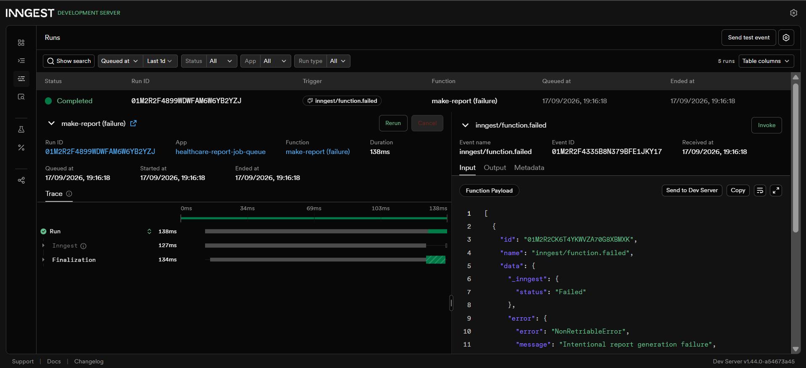
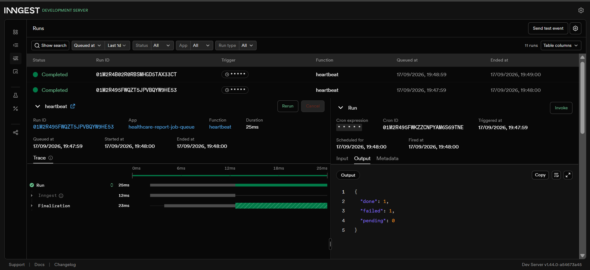

# Healthcare Report Job Queue

A FastAPI + Inngest background job system for asynchronous biomedical equipment maintenance reports.

The project demonstrates the durable background-job pattern:

**Accept fast -> work in the background -> report status**

## What it does

The API accepts a report request and immediately returns a `202 Accepted` response with a report ID.

Inngest then processes the report asynchronously.

The system currently demonstrates:

- FastAPI HTTP API
- Inngest background functions
- Durable step execution
- 8-second simulated slow work
- Report status tracking
- Retry handling
- Failure handling
- Scheduled cron heartbeat
- In-memory report state for local development

## Architecture

```text
Client
  |
  | POST /reports
  v
FastAPI
  |
  | 202 Accepted
  | {id, topic, status: pending}
  v
Inngest event: report/requested
  |
  v
make-report
  |
  +-- do-the-slow-work
  |       |
  |       +-- 8 second durable sleep
  |
  +-- build-report
  |       |
  |       +-- success -> done
  |       |
  |       +-- failure -> retry
  |
  +-- on_failure
          |
          +-- failed

GET /reports/{id}
  |
  +-- pending
  +-- done
  +-- failed
```

## Requirements

- Python 3.13+
- FastAPI
- Uvicorn
- Inngest Python SDK
- Node.js / npm for the Inngest Dev Server

## Local setup

Create and activate the virtual environment:

```powershell
py -3.13 -m venv .venv
.\.venv\Scripts\Activate.ps1
```

Install dependencies:

```powershell
python -m pip install fastapi uvicorn inngest python-dotenv
```

Start FastAPI:

```powershell
python -m uvicorn main:app --reload --port 8000
```

Start the Inngest Dev Server in another terminal:

```powershell
npx inngest-cli@latest dev -u http://localhost:8000/api/inngest
```

Open the Inngest dashboard:

```text
http://localhost:8288
```

## API endpoints

| Method | Endpoint | Purpose |
|---|---|---|
| GET | `/health` | Health check |
| POST | `/reports` | Create a background report job |
| GET | `/reports/{id}` | Check report status |
| GET / POST / PUT | `/api/inngest` | Inngest function serving endpoint |

### Create a report

```powershell
Invoke-RestMethod `
    -Uri "http://localhost:8000/reports" `
    -Method POST `
    -ContentType "application/json" `
    -Body '{"topic":"Biomedical Equipment Maintenance Operations Report"}'
```

Successful requests return `202 Accepted`:

```json
{
  "id": "report-id",
  "topic": "Biomedical Equipment Maintenance Operations Report",
  "status": "pending"
}
```

### Check report status

```powershell
Invoke-RestMethod "http://localhost:8000/reports/{id}"
```

Completed reports contain:

```json
{
  "id": "report-id",
  "topic": "Biomedical Equipment Maintenance Operations Report",
  "status": "done",
  "result": {
    "report_id": "report-id",
    "topic": "Biomedical Equipment Maintenance Operations Report",
    "summary": "Background report generated for: Biomedical Equipment Maintenance Operations Report"
  }
}
```

## Failure and retry behavior

The system distinguishes invalid input from background processing failure.

### Invalid input

A request without a valid `topic` is rejected immediately:

```text
POST /reports
{}
    |
    v
400 Bad Request
```

No background event is sent.

### Background failure

The topic `fail` intentionally raises an exception inside report generation:

```text
POST /reports
{"topic":"fail"}
    |
    v
202 Accepted
    |
    v
make-report
    |
    v
failure
    |
    v
retry
    |
    v
retry
    |
    v
final failure
    |
    v
make-report (failure)
    |
    v
status = failed
```

The `make-report` function is configured with:

```python
retries=2
```

This configures two retries after the initial attempt.

The final failure is handled by the `on_failure` function, which updates the report state to `failed`.

## Cron heartbeat

The project includes an Inngest cron function named `heartbeat`.

Current development schedule:

```text
* * * * *
```

This runs every minute and counts:

- pending reports
- completed reports
- failed reports

Example heartbeat output:

```json
{
  "done": 1,
  "failed": 1,
  "pending": 0
}
```

### Cron examples

Daily at 08:00:

```text
0 8 * * *
```

Sunday at 22:00:

```text
0 22 * * 0
```

## Inngest functions

| Function | Trigger | Purpose |
|---|---|---|
| `say-hello` | `test/hello` | Stage 1 background-job demonstration |
| `make-report` | `report/requested` | Processes report jobs |
| `make-report (failure)` | `inngest/function.failed` | Records final job failure |
| `heartbeat` | `* * * * *` | Reports pending/done/failed counts |

## Execution evidence

### Stage 3 - failure handling

The Inngest dashboard shows the failed `make-report` execution and the completed failure handler.



### Stage 4 - cron heartbeat

The Inngest dashboard shows the heartbeat firing on the `* * * * *` schedule and returning report counts.



Example observed output:

```json
{
  "done": 1,
  "failed": 1,
  "pending": 0
}
```

## Implementation stages

### Stage 0

FastAPI server and health endpoint.

### Stage 1

First Inngest background function with a durable sleep step.

### Stage 2

Asynchronous report creation, status polling, and background report generation.

### Stage 3

Intentional failure path, two retries, and final failure handling.

### Stage 4

One-minute cron heartbeat with report-state counts.

## Current storage limitation

Report state is currently stored in an in-memory Python dictionary.

This is intentional for the local assignment implementation.

Restarting the FastAPI process clears the report records. Inngest provides durable execution for the background function, but the application's report state is not yet persisted in a database.

A production implementation would use durable application storage such as PostgreSQL.

## Git checkpoints

```text
Stage 0: hello server
Stage 1: add Inngest background function
Stage 2: add background report jobs
Stage 3: add retries and failure handling
Stage 4: add cron heartbeat
```

## Project status

The core background-job workflow, failure handling, and scheduled heartbeat have been implemented and verified locally with the Inngest Development Server.
